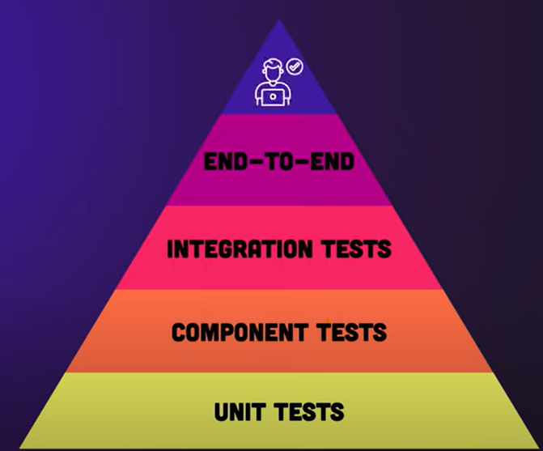

# Testkonzept
### Beschreibung
Für das Testkonzept orientieren wir uns an der Testpyramide und deren Testarten, um die Funktionalität der To-Do-List Anwendung inkl. deren User Stories sicherzustellen. Ziel des Konzeptes ist es aufzuzeigen, wo welche Tests wofür eingesetzt werden inkl. erster Testfälle.

### Testarten (Testpyramide)

|Testart|Wie (Tool)| Ziel / Funktion |Mögliche Testfälle|
|-|-|-|-|
| End-to-End Tests | Systemtesten mit Cypress| Ganzes System testen| Erstellen / Löschen / Editieren einer To-Do |
| Integrationstest   | Manuelle Schnittstellentests mit Swagger | Schnittstellen testen Backend| CRUD To-Do-List (Jeden Endpunkt)|
| Component Test| Frontend mit Jest| Laden von Seiten sicherstellen| Seite /home / new / edit|
| Unittest| Backend mit JUnit & Mockito| Einzelne Codeeinheiten wie Funktionen testen | Erstellen, Bearbeiten, Löschen|

### Testfälle

Front und Backend
- To-Do Erfassen (mit Priorität, Fälligkeitsdatum und bestehende Kategorie )
- To-Do Holen / Anzeigen
- To-Do Bearbeiten
- To-Do Löschen

- To-Do Holen / Anzeigen -> Filtern/ Sortieren nach Priorität & Fälligkeitstadum

**evtw. nur Frontend oder eigene Tabelle**
- To-Do Kategorie Erstellen

Frontend:
- Erstellen: Fälligkeitsdatum auswählen
- Anzeigen: Fälligkeitsdatum , Kategorie anzeigen, Farbliche hervorhebung für Aufgaben innerhalb der nächsten 24 Stunden fällig sind

Berücksichtigen bei den Tests: 
- Grenzwerte (max.Länge eines Titels beim Erstellen der ToDo)
- negatives Verhalten (eingabe ungültiges Datum eingeben, keine Priorität mitgeben)

### Testumgebung:
CICD Github Action Pipeline (Ubuntu) 

### Integrationtests:
Docker Compose neu starten, um sauber zu starten bei jeder Manuellen durchführung

